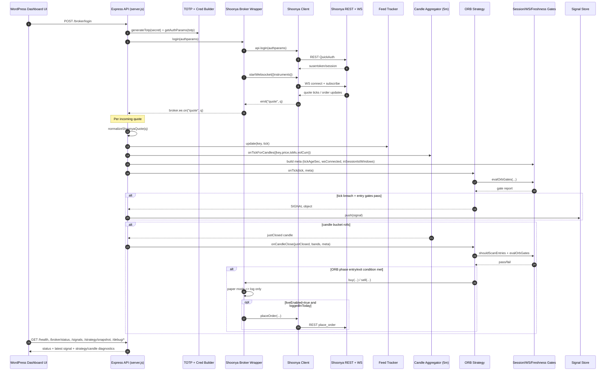

# TradingKriya Server — Context Preamble (paste into new chat)

We are building a Railway-hosted Node.js (CommonJS) trading server that connects to Shoonya broker websocket, builds ticks/candles, runs strategy gates, and exposes UI-friendly debug + status endpoints for a WordPress dashboard (investingkriya.in). This is the “server activities” track: tick handling, gating, signals, strategy execution.

## Current status (working)
- Server is up on Railway and reachable.
- Fixed Railway 502 issue: must listen on `process.env.PORT` (not hardcoded).
- Fixed CORS preflight: using `cors` or explicit middleware allowing `Content-Type` and `X-IK-Key`.

## Broker integration
- Shoonya integration is wired via `createShoonyaBroker()` which wraps `createShoonyaClient()` (RestApi + websocket).
- Daily login is required (SEBI): UI should trigger a login act (no manual TOTP entry).
- TOTP is generated server-side using `totpgenerator` + secret (secret must be in env, not in repo).
- Added a Delta Exchange **market-data provider** (public ticker polling) for global silver quote support.
- Broker runtime status fields used by UI:
  - `loggedInToday` (boolean)
  - `ws_connected` (boolean)
  - `lastLoginIstYmd` (YYYY-MM-DD, IST)
  - `lastError` (nullable {t,msg})
  - `liveEnabled` (safety switch; keep false until intentional)

## UI (WordPress dashboard)
- Existing mini dashboard polls endpoints every 1000ms.
- UI expects these endpoints:
  - `/health` (and/or `/status` alias)
  - `/broker/status` and `/broker/login`
  - `/global/silver` (Delta global silver quote)
  - `/debug/parsed`
  - `/debug/vwap`
  - `/debug/candle`
  - optional paper endpoints `/paper/status`, `/paper/trades`
- UI shows a dot:
  - Red = not logged in
  - Orange = logged in but WS down
  - Green = logged in + WS connected

## Endpoints currently implemented (foundation)
Always responds:
- `GET /` -> "OK"
- `GET /health` -> uptime
- `GET /status` -> alias to health (compat)
- `GET /broker/status` -> broker state JSON
- `GET /global/silver` -> latest Delta global silver quote cache (optional `?refresh=1`)

Login act:
- `POST /broker/login` -> performs TOTP login, starts WS + subscribe

Debug / UI support (responds even before login but returns empty/not-ready):
- `GET /debug/parsed?tk=8080`
  - returns `{hasQuote:false}` before ticks
  - returns parsed tick after ticks: ltp, pctChange, cumQty, turnoverCr, receivedAt, raw
- `GET /debug/vwap?tk=8080`
  - currently implemented as rolling mean/stdev bands over recent ticks (not true volume VWAP yet)
- `GET /debug/candle?tk=8080`
  - returns `{current,lastClosed}` 5m candles built from live ticks
  - before ticks: current/null

Security:
- `/broker/login` can be protected via header: `X-IK-Key: <key>` (server env `IK_KEY`)
- CORS allows WordPress origin.

## Tick / candle foundation
- We store latest ticks in memory (e.g., `R.lastQuote[key] = q`).
- Candle builder: in-memory 5m aggregator producing:
  - `current: {dayKey,tStart,o,h,l,c,v}`
  - `lastClosed: {dayKey,tStart,o,h,l,c,v}`
- Candle volume is best-effort: uses cumulative volume delta if available, else tick-count.

## Strategy foundation
- ORB strategy was split into multiple logical files under `/strategies/orb/` (index + helpers).
- Engine loads strategies (created earlier). We had a bug `resetOrbPublic is not defined` and it’s fixed.
- We used a paper broker smoke test earlier; now broker is Shoonya-connected and we are building the “signal pipeline”.

## Known gotchas we already hit (avoid repeating)
- Do NOT mix `require()` with top-level `await` in `server.js` (ERR_AMBIGUOUS_MODULE_SYNTAX). Wrap awaits in `async function main(){...}` and call main().
- Railway must bind to `process.env.PORT`.
- CORS preflight must allow `Content-Type`.

## What we want to build next (focus of new chat)
1) Tick pipeline:
   - standardize tick shape (ltp, tsMs, volume fields)
   - maintain `lastTickAgeSec` / `receivedAt` consistently for UI
2) Gates:
   - time-window gate (session times IST)
   - feed freshness gate (skip decisions if stale)
   - volatility / range gates if needed
3) Signal generation:
   - compute signals from candles/ticks (e.g., ORB breach, retest confirmation)
   - expose `GET /signals` or include in `/status`
4) Order handling:
   - keep `liveEnabled=false` by default
   - paper-first execution path; live orders only when explicitly enabled
5) Observability:
   - `/logs` or `/debug/state` snapshots for debugging (in-memory)

Please assume we are continuing from this exact baseline and help implement the next server-side pieces cleanly with small, maintainable modules.

## Sequence diagram (runtime flow from `server.js`)

